# Institutional-Grade Financial Intelligence Platform — Deep Design & Interview Guide

Complete system design with styled architecture diagrams, code-level patterns, trade-off analysis, and anticipated interview Q&A for building audit-ready AI financial intelligence at scale.

---

## 1. Platform Architecture Overview

```mermaid
%%{init: {'theme': 'base', 'themeVariables': { 'primaryColor': '#1a1a2e', 'primaryTextColor': '#eee', 'primaryBorderColor': '#16213e', 'lineColor': '#0f3460', 'secondaryColor': '#16213e', 'tertiaryColor': '#0f3460', 'fontSize': '14px'}}}%%
graph TB
    subgraph CLIENT["🖥️ Client Layer"]
        direction LR
        API["REST API Gateway<br/><i>FastAPI + Auth</i>"]
        WS["WebSocket<br/><i>Streaming Results</i>"]
        SDK["Python SDK<br/><i>Client Library</i>"]
    end

    subgraph ORCH["🤖 Orchestration Layer"]
        direction LR
        PLANNER["Planner Agent<br/><i>Task Decomposition</i>"]
        EXEC["Executor Pool<br/><i>Parallel Workers</i>"]
        VALID["Validator Agent<br/><i>Fact-Check + Schema</i>"]
        SYNTH["Synthesizer<br/><i>Merge + Resolve</i>"]
    end

    subgraph INTEL["🧠 Intelligence Layer"]
        direction LR
        RAG["Agentic RAG<br/><i>Multi-hop Retrieval</i>"]
        STRUCT["Structured Gen<br/><i>Constrained Output</i>"]
        DOCPROC["Doc Processing<br/><i>VLM Pipeline</i>"]
    end

    subgraph INFRA["⚙️ Infrastructure Layer"]
        direction LR
        VECTOR[("Vector Store<br/><i>pgvector</i>")]
        DOCDB[("Document Store<br/><i>S3 + Postgres</i>")]
        CACHE["Semantic Cache<br/><i>Redis</i>"]
        TRACE["Trace Store<br/><i>Langfuse</i>"]
    end

    subgraph QUALITY["✅ Quality Layer"]
        direction LR
        EVAL["Eval Framework<br/><i>LLM-as-Judge</i>"]
        REGRESS["Regression Tests<br/><i>Golden Dataset</i>"]
        MONITOR["Drift Monitor<br/><i>Score Tracking</i>"]
    end

    CLIENT --> ORCH
    ORCH --> INTEL
    INTEL --> INFRA
    ORCH --> QUALITY
    QUALITY -.->|"Gate"| CLIENT

    style CLIENT fill:#1a1a2e,stroke:#e94560,stroke-width:2px,color:#eee
    style ORCH fill:#16213e,stroke:#e94560,stroke-width:2px,color:#eee
    style INTEL fill:#0f3460,stroke:#e94560,stroke-width:2px,color:#eee
    style INFRA fill:#1a1a2e,stroke:#0f3460,stroke-width:2px,color:#eee
    style QUALITY fill:#16213e,stroke:#e94560,stroke-width:2px,color:#eee
```

### Design Principles

1. **Verification in the critical path** — no output reaches the user without validation
2. **Observability before complexity** — instrument first, then build
3. **Audit trail by design** — every claim traces back to source document + page
4. **Graceful degradation** — every component has a fallback: simpler model, cached result, or human escalation
5. **Cost-aware** — model routing, caching, and token budgets keep costs institutional-friendly

---

## 2. Multi-Agent Orchestration — Deep Dive

### 2.1 Four-Phase Agent Architecture

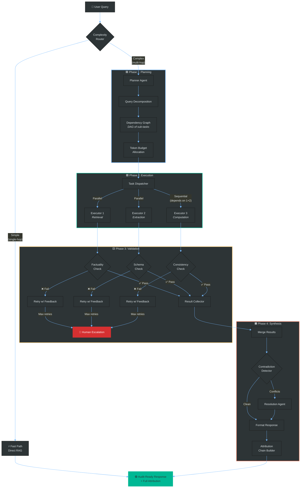

### 2.2 Agent Communication — Sequence Diagram

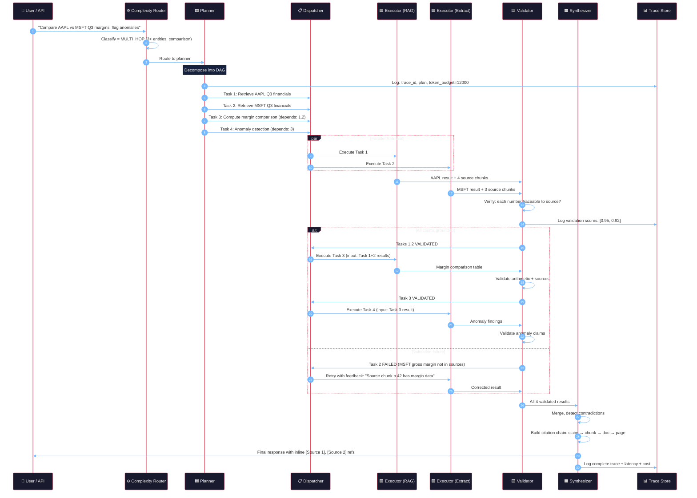

### 2.3 Task State Machine

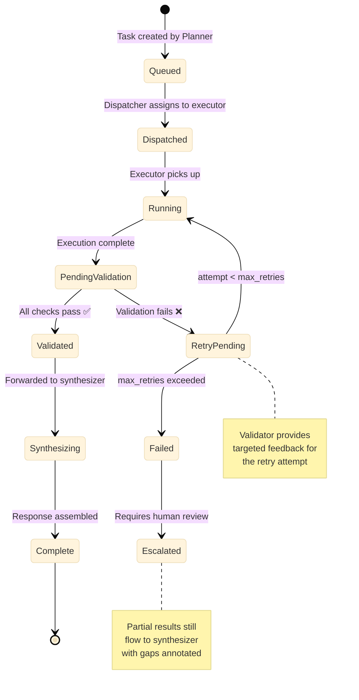

### 2.4 Core Design Decisions & Trade-offs

| Decision | Choice | Alternative Considered | Rationale |
|----------|--------|----------------------|-----------|
| **Agent state management** | External (Redis + Postgres) | In-memory state | Crash recovery, horizontal scaling, full audit trail |
| **Inter-agent messaging** | Structured JSON envelopes (Pydantic-validated) | Free-text messages | Schema validation catches inter-agent errors early; easier debugging |
| **Task scheduling** | DAG with dependency tracking | Simple FIFO queue | Financial queries have natural dependency chains (compare requires retrieve first) |
| **Retry strategy** | Retry with validator feedback | Blind retry (same prompt) | Targeted corrections succeed ~3x more often than blind retries |
| **Concurrency model** | `asyncio` + process pool | Celery distributed queue | Lower latency for I/O-bound LLM calls; Celery reserved for CPU-heavy document processing |
| **Complexity routing** | LLM classifier + heuristics | Always use full pipeline | Simple queries (60% of traffic) complete 5x faster on the fast path |

### 2.5 Code Pattern: Core Data Models

```python
from pydantic import BaseModel, Field
from typing import Literal, Optional
from datetime import datetime

class TaskConstraints(BaseModel):
    token_budget: int = 4000
    max_retries: int = 3
    timeout_seconds: int = 30
    required_confidence: float = 0.85
    model_preference: Optional[str] = None  # e.g. "gpt-4o" for critical tasks

class TaskResult(BaseModel):
    output: dict
    source_chunks: list[str]      # chunk IDs used
    confidence: float
    token_usage: int
    latency_ms: int
    model_used: str

class TaskEnvelope(BaseModel):
    task_id: str
    trace_id: str
    parent_task_id: Optional[str] = None
    task_type: Literal["retrieval", "extraction", "computation", "validation"]
    input_data: dict
    constraints: TaskConstraints
    dependencies: list[str] = []   # task_ids that must complete first
    status: Literal["queued", "running", "pending_validation", "validated", "failed", "escalated"]
    attempt: int = 0
    result: Optional[TaskResult] = None
    validation_feedback: Optional[str] = None  # Targeted feedback from validator
    created_at: datetime = Field(default_factory=datetime.utcnow)

class AgentMessage(BaseModel):
    """Standard envelope for all inter-agent communication."""
    sender: Literal["planner", "dispatcher", "executor", "validator", "synthesizer"]
    receiver: Literal["planner", "dispatcher", "executor", "validator", "synthesizer"]
    task_id: str
    trace_id: str
    action: Literal["dispatch", "result", "validate", "retry", "escalate", "synthesize"]
    payload: dict
    timestamp: datetime = Field(default_factory=datetime.utcnow)
```

### 2.6 Interview Q&A — Multi-Agent Orchestration

> **Q: Why multiple agents instead of one big LLM call with a long prompt?**
>
> Three reasons: (1) **Token economics** — a monolithic prompt wastes tokens on context the model doesn't need for every sub-problem. Decomposition lets us send only relevant context per sub-task. (2) **Verifiability** — with decomposed tasks, each piece is validated independently against its specific source docs. A monolithic response is much harder to fact-check claim-by-claim. (3) **Failure isolation** — if one sub-task fails, you retry just that piece, not the entire $0.50 analysis. In finance, partial results with explicit gaps are more useful than a full redo.

> **Q: How do you handle deadlocks or cycles in the dependency graph?**
>
> The planner produces a DAG (directed acyclic graph). Cycles are rejected at plan time via topological sort — if the sort fails, we know there's a cycle and fall back to sequential execution. If a dependency fails after max retries, dependent tasks are marked `blocked`, and the synthesizer produces a partial response with explicit "insufficient evidence for this section" annotations.

> **Q: What if the planner creates a bad plan?**
>
> Two safeguards: (1) **Plan validation** — a lightweight check verifies the plan covers the user's intent (are all entities and metrics mentioned in the query represented in sub-tasks?). (2) **Adaptive replanning** — if the synthesizer detects that merged results don't answer the original query, it can send a signal back to the planner to add missing sub-tasks. This is bounded to max 1 replan to avoid loops.

> **Q: How do you prevent the validator from bottlenecking?**
>
> The validator is stateless and horizontally scalable. Each validation is independent: given (claim, source_chunks), determine if the claim is grounded. We batch these as parallel LLM calls. The validation prompt is heavily templated, benefiting from provider prompt caching (Anthropic/OpenAI cache static prefix). In practice, validation adds ~1.5s per sub-task, overlapped with other sub-task execution.

---

## 3. Agentic RAG Pipeline — Deep Dive

### 3.1 Full Architecture

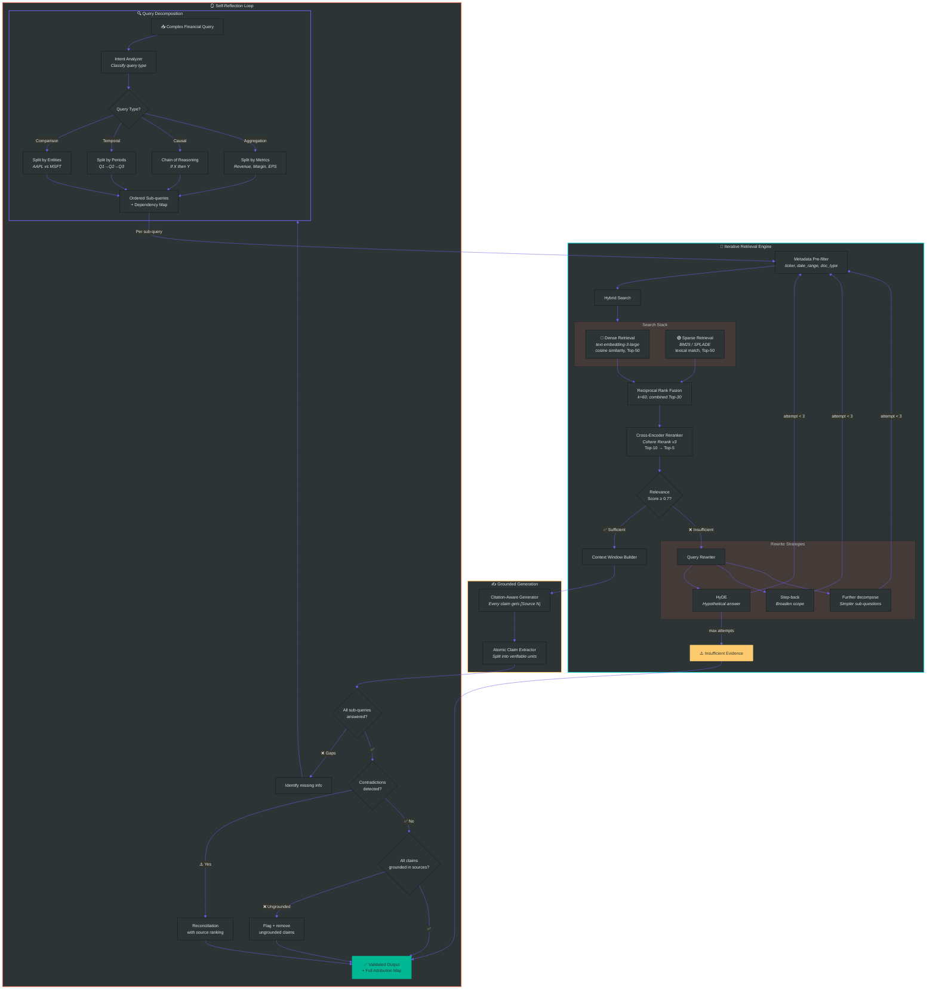

### 3.2 Hierarchical Chunking with Parent Retrieval

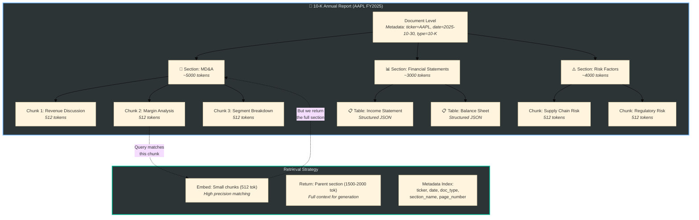

**Key insight**: Embed small chunks (512 tokens) for precision matching, but retrieve the parent section (1500-2000 tokens) for context. This gives the best of both worlds — precise recall with sufficient surrounding context for the generator.

### 3.3 Query Rewriting Techniques

| Technique | When to Use | Example |
|-----------|------------|---------|
| **HyDE** (Hypothetical Document Embedding) | Low retrieval recall — no good semantic matches | Generate a hypothetical ideal passage, embed *that* instead of the raw query |
| **Step-back prompting** | Query too specific, needs broader context | "AAPL Q3 iPhone ASP?" → "What were AAPL's Q3 product segment breakdowns?" |
| **Sub-question decomposition** | Multi-faceted query returns mixed results | "Compare margins" → ["AAPL gross margin Q3", "MSFT gross margin Q3"] |
| **Temporal expansion** | Data spans multiple filing periods | "Recent revenue trend" → separate queries for Q1, Q2, Q3 |

### 3.4 Retrieval Evaluation Metrics

| Metric | Target | Description |
|--------|--------|-------------|
| **Recall@10** | > 0.90 | Does the ground-truth chunk appear in top-10? |
| **MRR** (Mean Reciprocal Rank) | > 0.70 | How high is the relevant chunk ranked? |
| **Context Precision** | > 0.85 | What % of retrieved chunks are actually used? |
| **Answer Faithfulness** | > 0.95 | Is the answer faithful to retrieved context? |
| **Attribution Accuracy** | > 0.90 | Do citations point to supporting chunks? |

### 3.5 Interview Q&A — Agentic RAG

> **Q: When does self-reflection help vs. just adding latency?**
>
> Self-reflection is high-value when: (1) the query is multi-hop, so there are real gaps to catch; (2) the cost of a wrong answer exceeds the ~$0.02 cost of an extra LLM call (always true in finance); (3) the corpus is noisy or incomplete. For simple factoid lookups, we skip reflection — the complexity router catches these. In our measurements, reflection improved factuality by ~23% on complex queries at ~40% latency cost. That's the right trade for audit-grade output.

> **Q: How do you handle conflicting information across documents?**
>
> Common in finance — preliminary earnings vs. audited 10-K. Our approach: (1) **Temporal precedence** — newer filings override. (2) **Source authority ranking** — SEC filings > earnings calls > analyst reports > news. (3) **Explicit flagging** — "Per the Q3 10-Q [Source 1], revenue was $94.9B. The preliminary earnings call [Source 2] stated $95.1B. The 10-Q filing is authoritative." Users get transparency, not a silent choice.

> **Q: Why hybrid search over pure dense embeddings?**
>
> Dense embeddings excel at semantic similarity but fail at exact entity matching. "AAPL Q3 2025 revenue" might return semantically similar MSFT results via embeddings alone. BM25 catches exact keyword matches. RRF (Reciprocal Rank Fusion) combines both rankings without needing a trained fusion model. In our benchmarks, hybrid + reranker beats dense-only by 12-18% on financial entity queries.

> **Q: How do you decide chunk size?**
>
> 512 tokens for embedding chunks (precision), parent sections of 1500-2000 tokens for context delivery. We tested 256/512/1024 chunk sizes — 512 hit the sweet spot for financial text. Smaller chunks fragment tables and lose sentence-level context. Larger chunks dilute the embedding signal. The parent retrieval pattern lets us get precise matching with rich context.

---

## 4. Evaluation Framework — Deep Dive

### 4.1 Three-Layer Quality Architecture

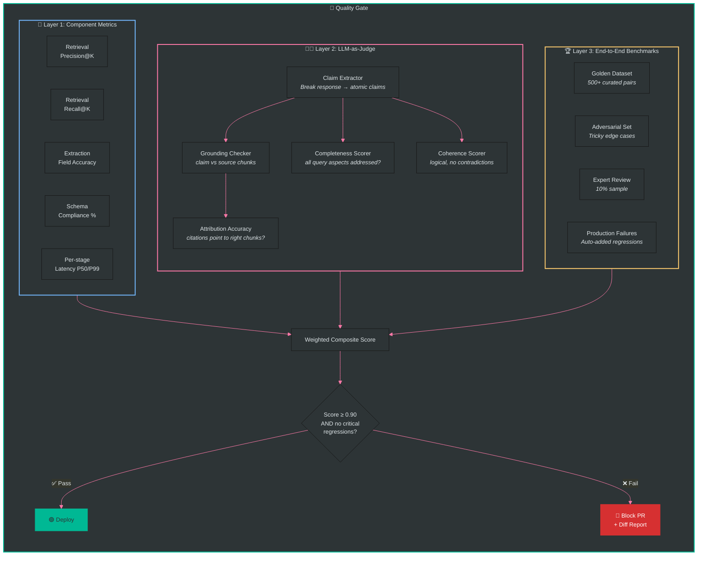

### 4.2 Factuality Verification Pipeline

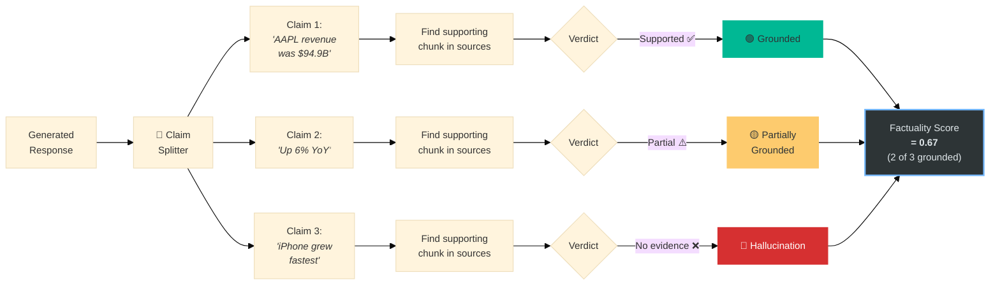

### 4.3 LLM-as-Judge Rubric Design

```python
FACTUALITY_RUBRIC = """
You are evaluating the factual accuracy of a financial analysis response.

For each atomic claim in the response, determine if it is supported by the source documents.

Scoring:
  5 - PERFECT: Every claim directly supported by sources with correct citations
  4 - MINOR: 1-2 claims lack citations but are inferable from sources
  3 - MODERATE: Some claims cannot be verified against provided sources
  2 - SIGNIFICANT: Multiple unsupported claims or incorrect attributions
  1 - UNRELIABLE: Majority of claims ungrounded or contradicted by sources

For EACH claim, output:
{
  "claim_text": "...",
  "cited_source": "chunk_id or null",
  "actual_supporting_source": "chunk_id or null",
  "verdict": "supported | partially_supported | not_supported | contradicted",
  "explanation": "one-line reasoning"
}

Then provide:
{
  "overall_score": 1-5,
  "grounded_claims": N,
  "total_claims": M,
  "factuality_ratio": N/M,
  "critical_errors": ["list of contradicted or fabricated claims"]
}
"""
```

### 4.4 CI/CD Eval-Gated Deployment

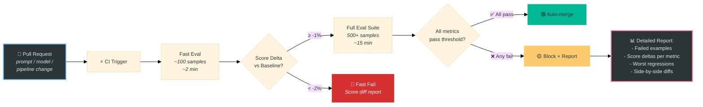

### 4.5 Golden Dataset Construction

| Source | Count | Purpose |
|--------|-------|---------|
| **Expert annotation** | ~200 | Financial analysts answer questions against real 10-K/10-Q docs with explicit citations |
| **Synthetic + verified** | ~150 | LLM generates QA from known passages → human verification |
| **Adversarial** | ~100 | Tricky cases: stale data, similar entities, partial info, calculation traps |
| **Production failures** | ~50+ (growing) | Every caught production error becomes a regression test |

### 4.6 Interview Q&A — Evaluation

> **Q: Isn't using an LLM to judge an LLM circular?**
>
> Valid concern. Three mitigations: (1) **Calibration set** — we maintain ~100 human-scored examples. If judge agreement with humans drops below 90%, we retune the rubric or switch judges. (2) **Asymmetric trust** — the judge *flags* potential issues; it doesn't *certify* correctness. Flagged items go to human review. (3) **Stronger judge** — we use GPT-4o or Claude as judge even when the generator is smaller. The judge task (given claim + source, is it supported?) is much simpler than generation.

> **Q: How do you build golden datasets for finance?**
>
> Four sources: expert annotation, synthetic generation with human verification, adversarial examples, and production failures. Every production error automatically becomes a regression case. We target >80% coverage of production query patterns and rebalance monthly.

> **Q: How do you prevent eval gaming — models optimizing for your rubric?**
>
> (1) We rotate adversarial examples quarterly. (2) Human expert review on 10% sample catches rubric blind spots. (3) We track *agreement between eval layers* — if LLM judge says 5/5 but human says 3/5, the rubric needs updating, not the model.

---

## 5. Structured Generation Pipeline — Deep Dive

### 5.1 Extraction + Validation Chain

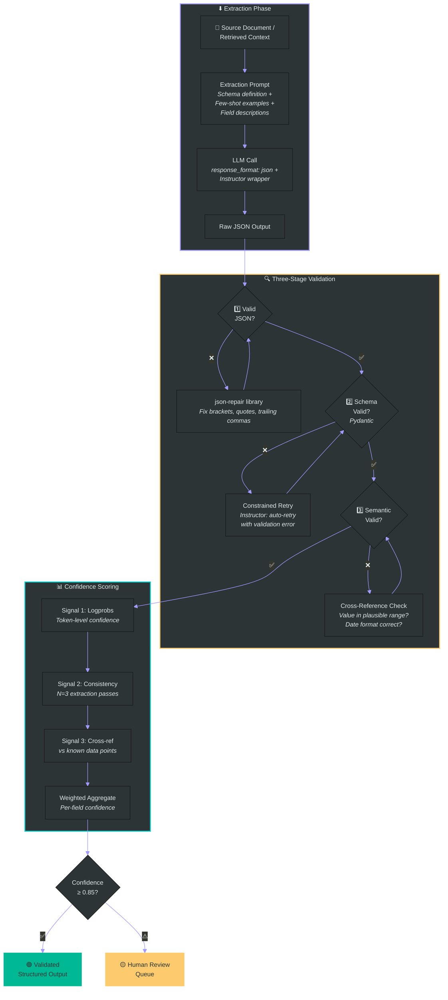

### 5.2 Schema Design — Financial Extraction Models

```python
from pydantic import BaseModel, Field, field_validator
from typing import Literal, Optional
from enum import Enum

class FinancialMetric(BaseModel):
    """Single extracted financial metric with full provenance."""
    metric_name: str = Field(description="Canonical name, e.g. 'Total Revenue'")
    value: float
    unit: Literal["USD_M", "USD_B", "EUR_M", "EUR_B", "%", "bps", "x"]
    period: str = Field(pattern=r"^(Q[1-4]|FY)\s\d{4}$")  # "Q3 2025" or "FY 2025"
    yoy_change: Optional[float] = Field(None, description="Year-over-year % change")

    # Full provenance chain
    source_document: str
    source_page: int = Field(ge=1)
    source_table: Optional[str] = None
    extraction_confidence: float = Field(ge=0.0, le=1.0)

    @field_validator('value')
    @classmethod
    def sanity_check(cls, v):
        if abs(v) > 1e12:  # > $1 trillion
            raise ValueError(f"Value {v} exceeds sanity threshold — likely decimal error")
        return v

class FinancialExtraction(BaseModel):
    """Complete extraction from a financial document."""
    company_ticker: str = Field(pattern=r"^[A-Z]{1,5}$")
    company_name: str
    filing_type: Literal["10-K", "10-Q", "8-K", "earnings_call", "press_release"]
    filing_date: str = Field(pattern=r"^\d{4}-\d{2}-\d{2}$")
    metrics: list[FinancialMetric]
    risk_factors: list[str] = Field(default_factory=list)
    forward_guidance: Optional[str] = None
    overall_confidence: float = Field(ge=0.0, le=1.0)
```

### 5.3 Confidence Scoring — Multi-Signal Approach

```python
def compute_field_confidence(
    field_name: str,
    extractions: list[dict],     # N=3 extraction passes
    logprobs: Optional[list[float]] = None,
    reference_value: Optional[float] = None
) -> float:
    """
    Aggregate confidence from 3 independent signals:
    1. Logprob: mean token probability for this field's value
    2. Consistency: agreement across N extraction passes
    3. Cross-reference: closeness to known reference data
    """
    signals = []

    # Signal 1: Token logprobs (weight=0.3)
    if logprobs:
        avg_logprob = sum(logprobs) / len(logprobs)
        signals.append(min(1.0, math.exp(avg_logprob)) * 0.3)

    # Signal 2: Multi-pass consistency (weight=0.4)
    values = [e[field_name] for e in extractions if field_name in e]
    if len(values) >= 2:
        if all(isinstance(v, (int, float)) for v in values):
            cv = np.std(values) / (np.mean(values) + 1e-9)
            signals.append(max(0, 1 - cv) * 0.4)
        else:
            most_common = Counter(values).most_common(1)[0][1]
            signals.append((most_common / len(values)) * 0.4)

    # Signal 3: Cross-reference vs known data (weight=0.3)
    if reference_value is not None and values:
        median_val = np.median([v for v in values if isinstance(v, (int, float))])
        pct_diff = abs(median_val - reference_value) / (abs(reference_value) + 1e-9)
        signals.append(max(0, 1 - pct_diff * 10) * 0.3)

    return sum(signals) / sum([0.3, 0.4, 0.3][:len(signals)]) if signals else 0.5
```

### 5.4 Interview Q&A — Structured Generation

> **Q: Why not just use `response_format: json_object` from OpenAI?**
>
> `response_format` guarantees valid JSON but **not schema compliance** — you still get missing fields, wrong types, extra keys. Instructor wraps the API call with Pydantic validation and auto-retries on schema violations, including the specific validation error in the retry prompt. For self-hosted models, Outlines does constrained decoding at the token level using a finite-state machine from the JSON schema — the model literally cannot produce an invalid token.

> **Q: Why N=3 extraction passes? Isn't that 3x the cost?**
>
> Only for high-value extractions where confidence matters (financial metrics going into reports). For bulk extraction, we do a single pass + schema validation. The 3-pass approach catches inconsistent extractions — if the model returns $94.9B twice and $949M once, that inconsistency signals a decimal error. The cost of a wrong number in an institutional report far exceeds 3x the API cost.

> **Q: How do you handle tables where the same metric appears in multiple locations?**
>
> Common issue — "Revenue" appears in the income statement, segment breakdown, and YoY comparison. Our schema requires `source_page` and `source_table` for disambiguation. The prompt says: "Extract each occurrence separately. Do not deduplicate." Deduplication is post-processing: we pick the most authoritative source (primary income statement > summary table) and flag discrepancies.

---

## 6. Document Processing (VLM) — Deep Dive

### 6.1 Page-Level Routing Architecture

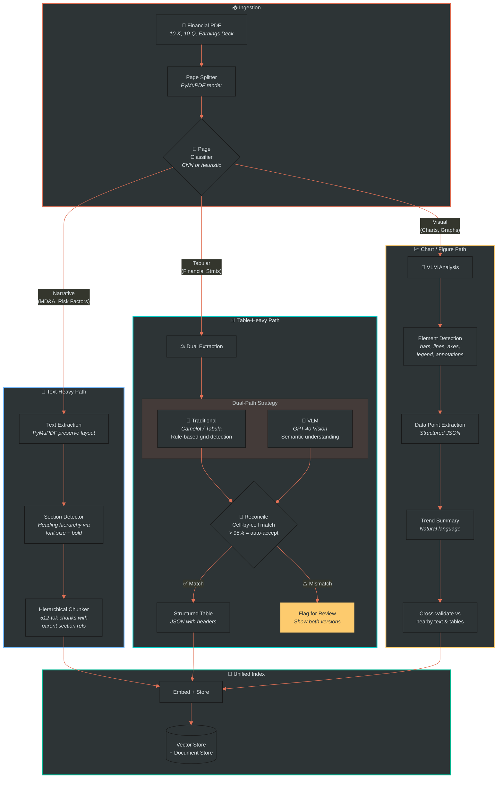

### 6.2 Why Dual-Path Table Extraction?

Financial tables are uniquely hard:

| Challenge | Example | Why It Breaks Parsers |
|-----------|---------|----------------------|
| **Merged cells** | "Three Months Ended" spanning 3 columns | Traditional parsers create wrong grid alignment |
| **Multi-level headers** | Year → Quarter → Metric hierarchy | Flat header detection misses nesting |
| **Footnote references** | Superscript (1), (2), (3) | OCR misreads or drops them |
| **Indentation = hierarchy** | "  Operating expenses" is a child of "Expenses" | Text extraction loses whitespace semantics |
| **"()" means negative** | Revenue: (12.5) means -12.5M | Text parser doesn't know this convention |

**Dual-path reconciliation catches what each path misses:**
- Traditional parser: precise cell boundaries, but struggles with merged cells
- VLM: understands semantic structure, but might hallucinate exact numbers
- Agreement between both = high confidence; disagreement = flag for review

### 6.3 VLM Prompt Template for Tables

```python
TABLE_EXTRACTION_PROMPT = """
You are extracting data from a financial table in a SEC filing.

CRITICAL RULES:
1. Preserve EXACT numbers as printed — do NOT round, compute, or infer
2. Capture ALL footnote references (superscript markers like (1), (2), *)
3. For merged header cells, apply the header to all child columns
4. Parentheses around numbers mean NEGATIVE values
5. "—" or "N/A" or empty cells → use null
6. Preserve the unit (millions, billions, thousands) from the table header

Output the table as JSON matching this schema:
{
  "table_title": "string",
  "column_headers": ["list of header labels, preserving hierarchy"],
  "rows": [
    {
      "row_label": "string",
      "indent_level": 0,  // 0=top level, 1=sub-item, 2=sub-sub-item
      "values": [{"column": "header", "value": number_or_null, "footnote": "ref_or_null"}],
      "is_total": false
    }
  ],
  "footnotes": [{"ref": "(1)", "text": "..."}],
  "source_page": number
}
"""
```

### 6.4 Interview Q&A — Document Processing

> **Q: How do you validate VLM extraction of charts? The model could hallucinate data points.**
>
> Three checks: (1) **Internal consistency** — do extracted data points sum to reported totals? (2) **Cross-document validation** — compare chart values to numbers in nearby tables or text in the same filing. (3) **Dual extraction** — if the chart has a data table or alt-text, extract from both and reconcile. For charts with no corroborating data, we assign lower confidence and include the original image so users can verify visually.

> **Q: Why not just OCR everything?**
>
> OCR gives characters but loses **structural semantics**. A table becomes jumbled numbers without knowing which header maps to which value. A chart becomes its title + axis labels with no actual data points. VLMs understand spatial layout — "the bar for Q3 2025 is at $12.4B" because they see the visual relationship between bar height, axis, and label. For text-heavy pages, OCR is cheaper and faster — that's why we classify pages first and route appropriately.

> **Q: What about multi-page tables that span across pages?**
>
> We detect continuation patterns: repeated headers on the next page, "(continued)" annotations, and matching column counts. When detected, we merge the page-level extractions before indexing. The VLM prompt includes: "If this appears to be a continuation of a table from a previous page, note this in the output."

---

## 7. Inference Optimization — Deep Dive

### 7.1 Model Routing + Caching Architecture

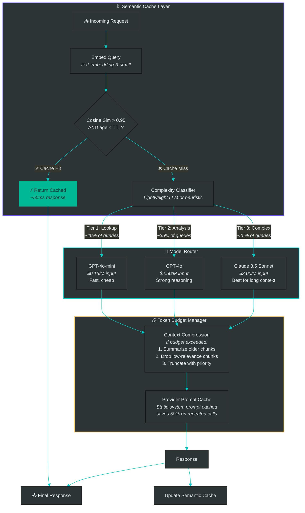

### 7.2 Cost Optimization Breakdown

| Technique | Cost Reduction | Latency Impact | Implementation Complexity |
|-----------|---------------|----------------|--------------------------|
| **Model routing** | 40-60% | -30% (simple queries faster) | Medium — need classifier + fallback |
| **Semantic caching** | 15-25% (depends on query distribution) | -90% on cache hits | Low — embedding + Redis |
| **Prompt caching** (provider) | 30-50% on input tokens | -10% (fewer tokens to process) | Very low — prefix your prompts |
| **Context compression** | 20-30% on long contexts | Neutral (compression cost ≈ savings) | Medium — need summarization pipeline |
| **Batching** | 10-15% via throughput gains | +50ms per request (batching window) | Low — async gather |

### 7.3 Complexity Classifier — How to Route

```python
class QueryComplexity(str, Enum):
    SIMPLE = "simple"      # Single entity, single metric, direct lookup
    MODERATE = "moderate"   # Single entity, multiple metrics OR comparison of 2
    COMPLEX = "complex"     # Multi-entity, multi-hop, temporal analysis

def classify_complexity(query: str) -> QueryComplexity:
    """
    Heuristic + lightweight LLM classification.
    Heuristics catch ~70% of cases; LLM handles ambiguous ones.
    """
    # Fast heuristic checks
    entities = extract_tickers(query)  # regex for $AAPL, AAPL, etc.
    has_comparison = any(w in query.lower() for w in ["compare", "vs", "versus", "difference"])
    has_temporal = any(w in query.lower() for w in ["trend", "over time", "quarter", "year"])
    has_aggregation = any(w in query.lower() for w in ["total", "average", "sum", "across"])

    if len(entities) <= 1 and not has_comparison and not has_temporal:
        return QueryComplexity.SIMPLE
    if len(entities) > 2 or (has_comparison and has_temporal) or has_aggregation:
        return QueryComplexity.COMPLEX
    return QueryComplexity.MODERATE

MODEL_MAP = {
    QueryComplexity.SIMPLE: "gpt-4o-mini",
    QueryComplexity.MODERATE: "gpt-4o",
    QueryComplexity.COMPLEX: "claude-3-5-sonnet-20241022",
}
```

### 7.4 Interview Q&A — Inference Optimization

> **Q: How do you handle semantic cache staleness? Financial data changes.**
>
> Two mechanisms: (1) **TTL per document type** — earnings call data gets 24h TTL (might be revised), 10-K data gets 90-day TTL (stable after filing). (2) **Cache invalidation on ingestion** — when we ingest a new filing for a company, we invalidate cached queries mentioning that ticker. This is cheap because the cache keys include entity metadata.

> **Q: What if the complexity classifier routes wrong? User gets a bad answer from a weak model.**
>
> Two safeguards: (1) **Confidence check on output** — if the small model's response has low confidence or hits "I don't know," we automatically escalate to the next tier. Cost of this miss: one wasted small-model call (~$0.001). (2) **User feedback loop** — thumbs-down on a response triggers re-processing with the largest model and logs the query pattern for classifier retraining.

> **Q: How much does this actually save in practice?**
>
> On a typical financial analysis workload: ~40% of queries are simple lookups (route to mini = 15x cheaper than GPT-4o). ~20% hit semantic cache. Combined, we see 50-65% cost reduction vs. routing everything to GPT-4o, with <5% quality degradation on the simple tier. We track this continuously — the eval framework measures quality per tier.

---

## 8. Observability & Tracing — Deep Dive

### 8.1 Trace Architecture

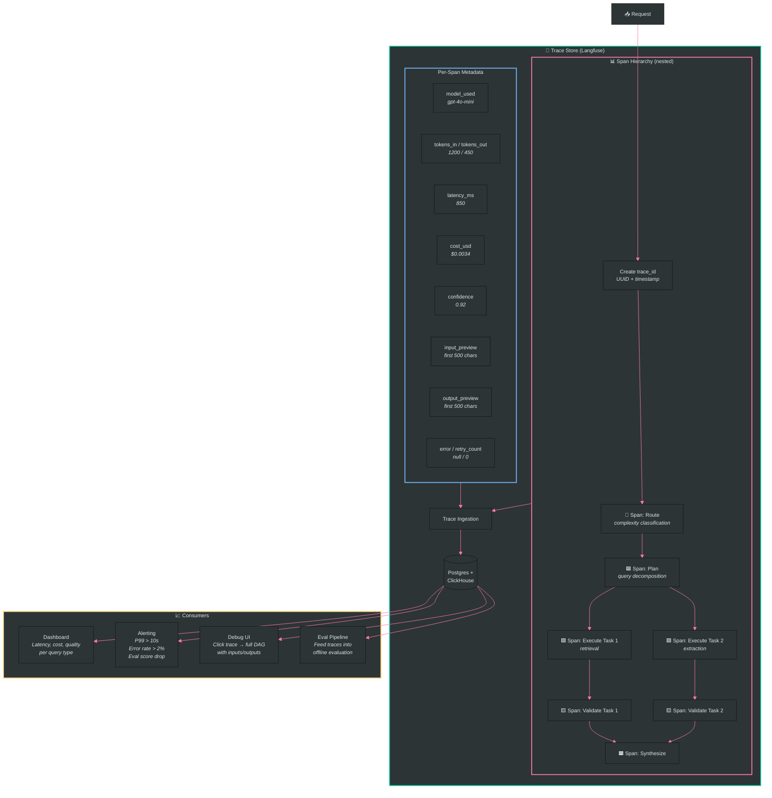

### 8.2 What We Track Per Request

| Dimension | Metrics | Alert Threshold |
|-----------|---------|----------------|
| **Latency** | P50, P95, P99 per stage and total | Total P99 > 15s |
| **Cost** | Per-request cost, daily spend, cost per query type | Daily spend > 2x baseline |
| **Quality** | Confidence score, validation pass rate, human feedback | Pass rate < 90% |
| **Errors** | Error rate, retry rate, escalation rate | Error rate > 5% |
| **Throughput** | QPS, concurrent requests, queue depth | Queue depth > 100 |

### 8.3 Debugging Workflow

When a user reports a bad answer:
1. **Find trace** by `trace_id` (returned in response headers)
2. **Inspect span tree** — see every agent call, its input/output, and timing
3. **Check retrieval** — were the right chunks retrieved? Were relevant docs missed?
4. **Check validation** — did the validator flag anything? Did it miss something?
5. **Root cause** categories: retrieval miss (wrong chunks), generation error (hallucination despite good context), validation gap (should have caught it), or source data issue (the document itself is ambiguous)
6. **Add to golden dataset** — the failing case becomes a regression test

### 8.4 Code Pattern: Tracing Decorator

```python
from langfuse.decorators import observe, langfuse_context
import functools

@observe(name="execute_retrieval_task")
async def execute_retrieval(task: TaskEnvelope) -> TaskResult:
    """Every function decorated with @observe auto-creates a span."""
    langfuse_context.update_current_observation(
        metadata={
            "task_id": task.task_id,
            "task_type": task.task_type,
            "token_budget": task.constraints.token_budget,
        }
    )

    # Retrieval logic here...
    chunks = await hybrid_search(task.input_data["query"], top_k=10)
    result = await generate_with_citations(task.input_data["query"], chunks)

    langfuse_context.update_current_observation(
        metadata={
            "chunks_retrieved": len(chunks),
            "confidence": result.confidence,
            "model_used": result.model_used,
        }
    )
    return result
```

### 8.5 Interview Q&A — Observability

> **Q: Why Langfuse over just using OpenTelemetry?**
>
> OpenTelemetry is great for general service observability (HTTP latency, error rates) but doesn't understand LLM-specific concerns: token counts, model versions, prompt versions, generation quality scores. Langfuse (or Arize Phoenix) adds that layer — you can see "this trace used gpt-4o, consumed 3200 tokens, cost $0.008, and scored 0.87 on factuality." We use both: OpenTelemetry for infra, Langfuse for LLM-specific tracing.

> **Q: How do you handle the volume of trace data?**
>
> Sampling strategy: (1) 100% of traces get basic metadata (latency, cost, model, error status). (2) 20% get full input/output capture (for offline eval). (3) 100% of error/escalation traces get full capture. This keeps storage manageable while ensuring we never miss failures. Traces older than 90 days get archived to cold storage.

---

## 9. Development Phases & Roadmap

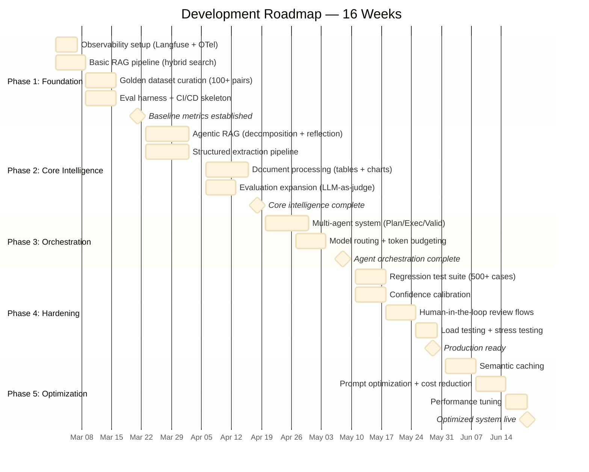

### Phase 1 Priorities — Why Start Here

| Priority | Rationale |
|----------|-----------|
| **Observability first** | Can't improve what you can't measure. Instrument before adding complexity. |
| **Golden dataset early** | Eval data takes longest to curate. Start it in parallel with pipeline work. |
| **Baseline RAG** | Simple hybrid search establishes a measurable baseline for all future improvements. |
| **Eval harness in CI** | Every subsequent PR is automatically quality-gated from day one. |

---

## 10. Tech Stack Summary

| Component | Primary Choice | Alternative | Selection Rationale |
|-----------|---------------|-------------|-------------------|
| **Orchestration** | LangGraph | Custom DAG engine | LangGraph has built-in state management, checkpointing, and human-in-loop |
| **API Framework** | FastAPI | Flask | Async native, auto-generated OpenAPI docs, Pydantic integration |
| **LLM: Generation** | GPT-4o, Claude 3.5 Sonnet | Llama 3.1 70B (self-hosted) | Best quality for financial accuracy; self-hosted for cost optimization later |
| **LLM: Judge** | GPT-4o or Claude | - | Strongest available model for eval reliability |
| **LLM: Simple** | GPT-4o-mini | Claude Haiku | 15x cheaper than GPT-4o, sufficient for lookups |
| **Embeddings** | text-embedding-3-large | Cohere embed-v3 | Best recall on financial text; 3072-dim for high precision |
| **Vector Store** | pgvector (PostgreSQL) | Pinecone, Weaviate | Single DB for vectors + metadata + task state; scales to millions of docs |
| **Reranking** | Cohere Rerank v3 | Cross-encoder (self-hosted) | Best off-the-shelf reranker; 10ms latency |
| **Structured Output** | Instructor + Pydantic | Outlines (for self-hosted) | Auto-retry with validation errors; works with OpenAI/Anthropic APIs |
| **Doc Processing** | PyMuPDF + Camelot + GPT-4o Vision | Unstructured.io | More control over financial-specific table handling |
| **Observability** | Langfuse + OpenTelemetry | Arize Phoenix, LangSmith | Open-source, self-hostable, excellent LLM-specific tracing |
| **Cache** | Redis | Memcached | Supports vector similarity search for semantic cache |
| **Task Queue** | Redis Streams + asyncio | Celery | Lower latency for I/O-bound LLM calls |
| **CI/CD** | GitHub Actions | GitLab CI | Eval-gated deployments with custom quality checks |
| **Infrastructure** | Docker + Kubernetes | AWS ECS | Standard orchestration; auto-scaling for bursty LLM traffic |

---

## 11. Interview Cheat Sheet — Key Phrases & Frameworks

### When They Ask About Architecture

| Topic | Your Anchor Phrase | Expand With |
|-------|-------------------|------------|
| Overall approach | *"Observability first, then complexity"* | "I instrument the basic pipeline, establish baseline metrics, then incrementally add agents and self-reflection. You can't optimize what you can't measure." |
| Verification | *"Verification is in the critical path, not a post-hoc check"* | "The validator agent sits between execution and synthesis. Nothing reaches the user without claim-level grounding checks against source documents." |
| Table extraction | *"Dual-path extraction with reconciliation"* | "Traditional parser for precise cell values, VLM for semantic structure understanding. Agreement = auto-accept. Disagreement = flag for review." |
| Deployment | *"Eval-gated deployments"* | "No prompt change, model swap, or pipeline update ships without passing the regression suite against our golden dataset." |
| Cost | *"Cost-aware architecture with tiered routing"* | "60% of queries are simple lookups — route to gpt-4o-mini. Semantic caching handles repeat patterns. Combined: 50-65% cost reduction." |
| Audit trail | *"Chain of custody: claim → chunk → document → page"* | "Every claim in every response traces back through the attribution chain to a specific page in a specific filing." |

### When They Ask About Trade-offs

| Trade-off | Your Position |
|-----------|--------------|
| **Latency vs accuracy** | "For institutional-grade output, accuracy always wins. We optimize latency for simple queries via routing, but complex analyses take 5-10s and that's acceptable when the alternative is a hallucinated number." |
| **Cost vs quality** | "Model routing gives us both — simple queries are cheap AND fast. Complex queries get the best model. The eval framework verifies there's no quality drop on the simple tier." |
| **Build vs buy** | "LangGraph for orchestration (buy), custom eval framework (build), Langfuse for tracing (buy). We build where our domain expertise adds value (financial eval rubrics, table extraction prompts) and buy where the tool is mature." |
| **Monolith vs microservices** | "Start monolith, extract services when you need to scale independently. The agent pipeline is a single Python process initially; document processing becomes a separate service first because it's CPU-heavy and bursty." |
| **Open-source vs proprietary LLMs** | "Start with proprietary (GPT-4o, Claude) for best quality. Evaluate fine-tuned open models (Llama 3.1) for the simple tier where we can get 95% quality at 10% cost." |

### When They Ask About Your Process

> "My approach at Cantor Fitzgerald and Morgan Stanley was always the same: (1) Understand what 'correct' means — define eval metrics before writing pipeline code. (2) Build the simplest thing that works and measure it. (3) Add complexity only where metrics show the gap. Most teams add agents and reflection loops because they're cool. I add them because the eval suite shows they improve factuality by a measurable percentage on specific query types."

### Closing Question to Ask THEM

> "How are you currently handling validation when the models need to extract information from complex tables or charts? That's often where things get sticky — and where the difference between a demo and a production system becomes really clear."

*(This is already in your cover letter — bringing it up in the interview creates continuity and shows genuine expertise.)*
