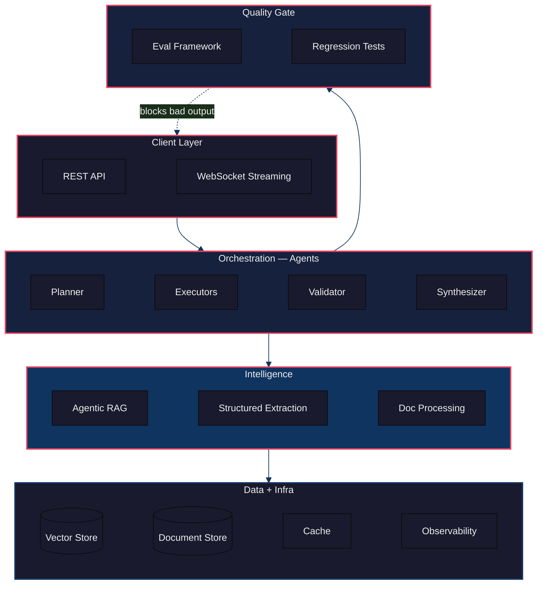
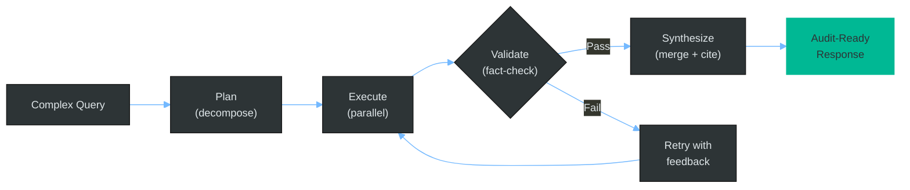
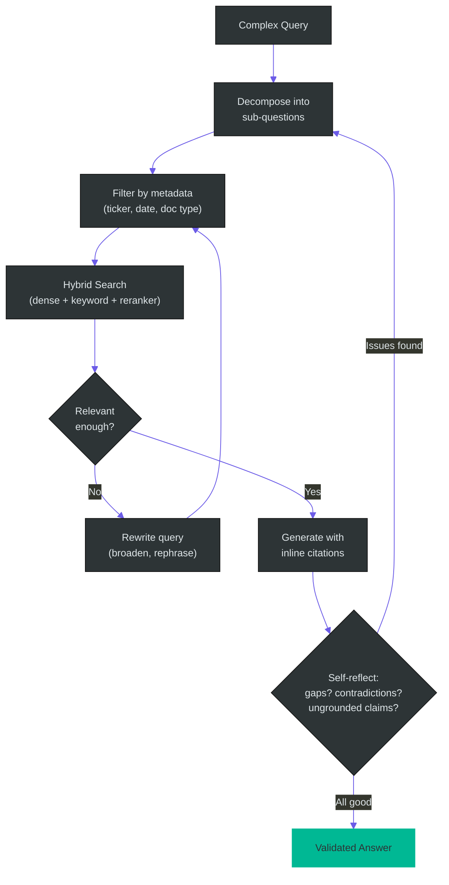
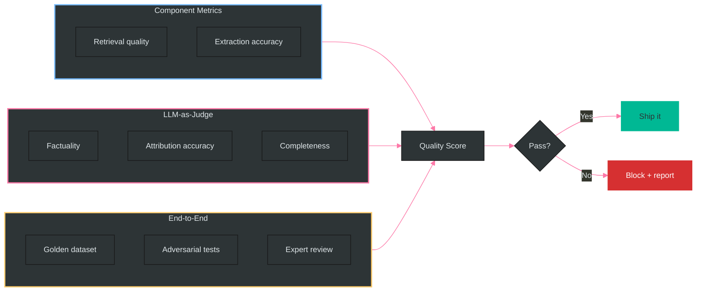
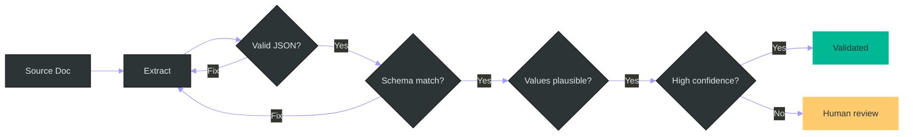
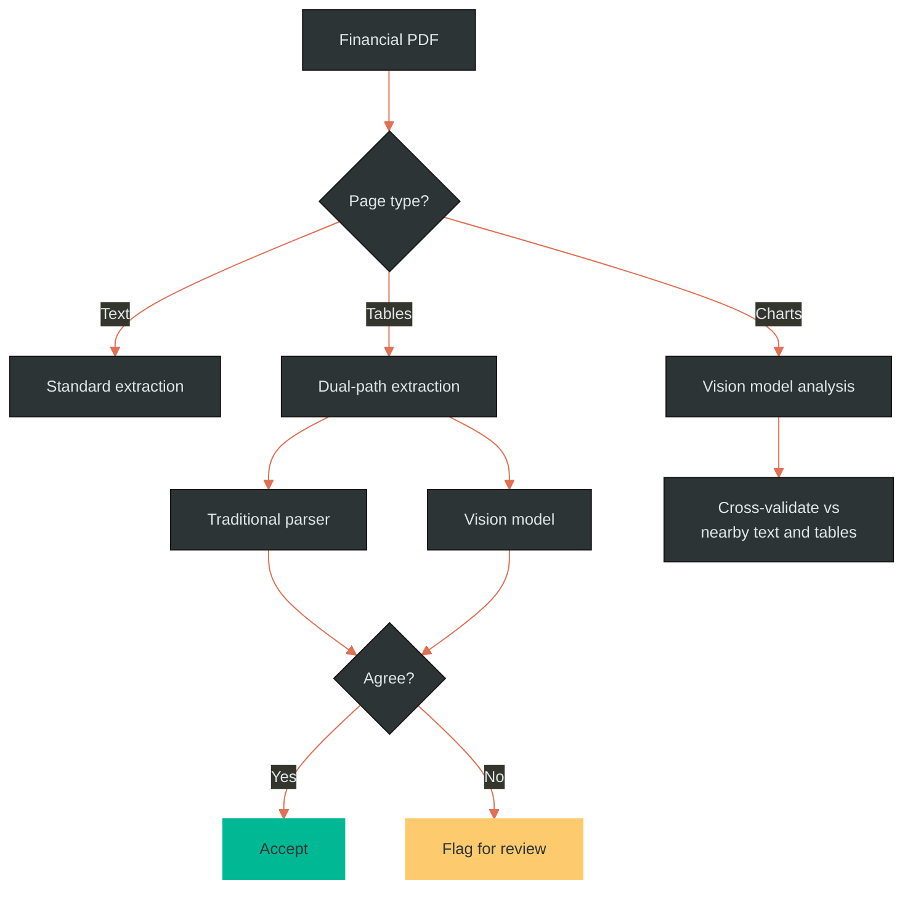
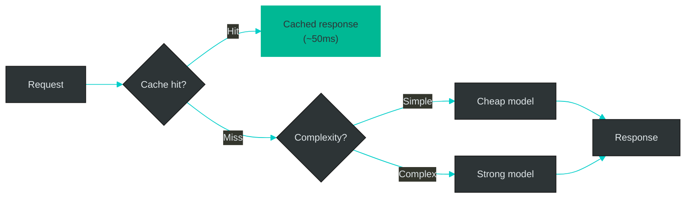
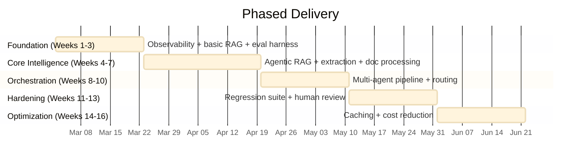

# Interview Prep — Financial Intelligence Platform

Conversational interview guide: how to walk through your design approach, what to say for each system component, and how to handle tough questions — all framed for a client building audit-ready AI for institutional finance.

---

## How to Use This Document

This is structured as a conversation flow. Each section has:
- **What they'll ask** — the likely question or topic
- **Your answer** — what to actually say (conversational, not spec-like)
- **A diagram** — to sketch on a whiteboard or reference
- **Follow-up traps** — hard follow-ups and how to handle them

---

## 1. "Walk us through how you'd architect this system."

### Your Answer

> "I think about it in five layers. At the top, the client layer — API, streaming. Below that, an orchestration layer where agents coordinate: a planner that breaks down complex queries, executors that do the actual work in parallel, a validator that checks everything against source documents, and a synthesizer that merges it all together.
>
> Below the agents sits the intelligence layer — agentic retrieval, structured extraction, and document processing for tables and charts. Under that, your data stores and caching. And wrapping around the whole thing, a quality layer — eval framework and regression tests that gate every deployment.
>
> The key principle: **nothing reaches the user without validation**. The validator is in the critical path, not a nice-to-have."

### Follow-up Traps

**"That's a lot of layers. Isn't this over-engineered?"**
> "Fair question. In practice, ~60% of queries are simple lookups that skip most of this — they go through a fast path with one retrieval and one generation step. The full orchestration only kicks in for complex multi-hop queries. So you get simplicity for the common case and rigor for the hard case."

---

## 2. "Tell me about the multi-agent approach."

### Your Answer

> "The flow is: **Plan → Execute → Validate → Synthesize**. The planner breaks a complex query into sub-tasks with dependencies — 'first retrieve AAPL financials, then MSFT, then compare margins.' Independent tasks run in parallel. Each result goes through a validator that checks every claim against the source documents. If validation fails, the executor gets specific feedback on *what* failed and retries. After max retries, it escalates to human review rather than guessing.
>
> The synthesizer merges validated results, checks for contradictions, and builds the citation chain — every claim links back to a specific page in a specific filing."

### Follow-up Traps

**"Why not just one big LLM call?"**
> "Three reasons. Token economics — decomposed tasks only get relevant context. Verifiability — each piece validates independently. And failure isolation — if one sub-task fails, you retry that piece, not the whole $0.50 analysis."

**"How do you handle agent failures gracefully?"**
> "The validator gives the executor targeted feedback: 'gross margin not found in cited source, try page 42.' That succeeds about 3x more than blind retry. After max retries, the synthesizer produces a partial response with explicit gaps — 'insufficient evidence for MSFT margins' — rather than fabricating."

**"What about deadlocks in the dependency graph?"**
> "The planner produces a DAG. Cycles are rejected at plan time via topological sort. If a dependency fails permanently, downstream tasks are blocked and the response notes the gap explicitly."

---

## 3. "How does your retrieval pipeline work?"

### Your Answer

> "Standard RAG breaks on complex financial queries. 'Compare AAPL vs MSFT Q3 margins' needs multiple retrievals, not one shot. So we decompose the query first, retrieve iteratively, and self-reflect at the end.
>
> Retrieval itself is hybrid — dense embeddings for semantic similarity plus keyword matching for exact entities. That's critical in finance because pure embeddings might return MSFT results when you asked about AAPL. Then a cross-encoder reranker picks the top results.
>
> After generation, a self-reflection step checks: did we answer every part of the question? Are there contradictions? Is every claim grounded in a source? If not, loop back."

### Follow-up Traps

**"When does self-reflection actually help vs. adding latency?"**
> "It helps when the query is multi-hop and the cost of being wrong exceeds the cost of one extra LLM call — which is always true in finance. For simple lookups, we skip it. Net result: ~23% factuality improvement on complex queries, ~40% more latency. Right trade for audit-grade output."

**"How do you handle conflicting sources?"**
> "Temporal precedence — newer filings win. Source authority — SEC filings beat earnings calls beat analyst reports. And we flag it transparently: 'The 10-Q says $94.9B, the earnings call said $95.1B. The 10-Q is authoritative.' The user sees the conflict, not a silent choice."

**"Why hybrid search?"**
> "Dense embeddings are great at semantics, terrible at exact matching. 'AAPL Q3 2025 revenue' should not return MSFT results just because they're semantically similar. BM25 catches keyword matches. Combined with a reranker, hybrid beats dense-only by 12-18% in our benchmarks."

---

## 4. "How do you ensure accuracy? What's the eval approach?"

### Your Answer

> "Three layers. First, component-level metrics — retrieval precision, extraction accuracy, schema compliance. Second, LLM-as-judge — a strong model evaluates factuality claim-by-claim against source documents. Third, end-to-end benchmarks against a curated golden dataset of 500+ question-answer pairs.
>
> All three feed into a composite quality score. Every prompt change, model swap, or pipeline update runs through this in CI. If the score drops, the PR is blocked automatically. No exceptions."

### How Factuality Verification Works

Break the response into atomic claims ("revenue was $94.9B", "up 6% YoY"). For each claim, check if it traces to a specific source chunk. Score each as supported / partial / unsupported / contradicted. Aggregate into a factuality ratio.

### Follow-up Traps

**"Isn't using an LLM to judge an LLM circular?"**
> "Only if you trust it blindly. We calibrate against ~100 human-scored examples — if judge agreement with humans drops below 90%, we retune the rubric. The judge flags issues; humans confirm. And the judge task — 'is this claim supported by this paragraph?' — is much simpler than the generation task."

**"How do you build the golden dataset?"**
> "Four sources: financial analysts annotating real filings, synthetic QA pairs with human verification, deliberately adversarial edge cases, and production failures — every caught error becomes a regression test."

**"How do you keep the eval from going stale?"**
> "Monthly review. Retire deprecated tests, add for new capabilities, track coverage of production query patterns. Target >80%."

---

## 5. "What about structured data extraction?"

### Your Answer

> "Financial extraction needs three validation stages. First, is the output valid JSON? If not, auto-repair and retry. Second, does it match the schema — right fields, right types? If not, constrained retry with the validation error in the prompt. Third, are the values plausible? Revenue can't be a quadrillion dollars — that's a decimal error.
>
> For confidence, we look at three signals: model token probabilities, consistency across multiple extraction passes, and cross-reference against known data. Low confidence goes to human review."

### Follow-up Traps

**"Why not just use OpenAI's JSON mode?"**
> "JSON mode guarantees valid JSON, not schema compliance. You still get missing fields, wrong types, extra keys. We add schema validation with auto-retry on violations."

**"Why extract multiple times?"**
> "Only for high-stakes extractions. If the model says $94.9B twice and $949M once, that inconsistency flags a decimal error. For bulk work, single pass with validation is fine."

---

## 6. "How do you handle complex documents — tables, charts?"

### Your Answer

> "This is actually the question I asked in my application — it's where most systems fall apart.
>
> We classify each page: text-heavy goes through standard extraction. Tables get dual-path treatment — a traditional parser for precise cell values and a vision model for semantic understanding. When both agree, we auto-accept. When they disagree, we flag for review.
>
> Charts go through the vision model to extract data points as structured data, then cross-validate against any nearby tables or text in the same filing."

### Why Tables Are Hard (know this cold)

- Merged cells throw off grid parsers
- Multi-level headers (Year → Quarter → Metric)
- Parentheses mean negative values — parsers don't know that
- Indentation encodes hierarchy — lost in text extraction
- Footnote references easily dropped by OCR

### Follow-up Traps

**"How do you validate chart extraction?"**
> "Three checks: internal consistency (do data points sum to totals?), cross-document validation (match to nearby tables), and for charts with no corroborating data, we lower confidence and include the original image for manual verification."

**"Why not just OCR everything?"**
> "OCR gives you characters but loses structure. A table becomes jumbled numbers without knowing which header maps to which value. Vision models understand spatial layout — they see the relationship between a bar's height, the axis, and the label."

---

## 7. "How do you manage cost at scale?"

### Your Answer

> "Three levers. First, model routing — about 60% of queries are simple lookups that run fine on a small cheap model. Complex queries get the best model. That alone saves 40-60%. Second, semantic caching — similar questions return cached answers, another 15-25%. Third, prompt caching through the provider — static system prompts get cached, saving 30-50% on input tokens."

### Follow-up Traps

**"What if the router sends a complex query to the cheap model?"**
> "Confidence check on output. If the small model returns low confidence, auto-escalate to the next tier. Cost of the miss: ~$0.001."

**"Cache staleness with changing financial data?"**
> "TTL per document type — earnings data gets 24h, 10-K data gets 90 days. Plus cache invalidation when new filings are ingested."

---

## 8. "What's your development approach?"

### Your Answer

> "I always start the same way: observability first. Instrument the basic pipeline so you can see what's happening. Then build a simple RAG baseline and measure it. Then add complexity — agents, self-reflection, multi-pass extraction — only where the metrics show the gap.
>
> Concretely: weeks 1-3 are foundation — tracing, basic RAG, golden dataset, eval harness in CI. Weeks 4-7 build the core intelligence. Weeks 8-10 add the multi-agent orchestration. Then hardening and optimization."

### Why This Order

> "Observability first because you can't improve what you can't see. Golden dataset early because it takes the longest to curate. Baseline RAG before agents because you need a measurable starting point. Hardening before optimization because correctness before speed."

---

## 9. Tech Stack (if they ask)

| Layer | Choice | One-line why |
|-------|--------|-------------|
| **Orchestration** | LangGraph | State management + checkpointing built in |
| **LLMs** | GPT-4o / Claude 3.5 / GPT-4o-mini | Tiered: quality vs cost |
| **Vectors** | pgvector | Single DB for vectors + metadata + state |
| **Reranker** | Cohere Rerank v3 | Best off-the-shelf, 10ms |
| **Extraction** | Instructor + Pydantic | Schema validation with auto-retry |
| **Docs** | PyMuPDF + Camelot + GPT-4o Vision | Control over financial table handling |
| **Tracing** | Langfuse + OpenTelemetry | LLM-specific + general infra |
| **Eval** | Custom + RAGAS | Domain-specific rubrics |

---

## 10. Your Anchor Phrases

These are short, memorable phrases to drop naturally in conversation:

- **"Observability first, then complexity."**
- **"Verification in the critical path, not post-hoc."**
- **"Dual-path extraction with reconciliation."**
- **"Eval-gated deployments — nothing ships without passing the regression suite."**
- **"Chain of custody: claim → chunk → document → page."**
- **"Add complexity only where metrics show the gap."**

---

## 11. Your Trade-off Positions

| If they ask about... | Say... |
|---------------------|--------|
| Latency vs accuracy | "Accuracy wins for institutional output. We optimize latency on simple queries via routing, but complex analysis at 5-10s is fine when the alternative is a hallucinated number." |
| Cost vs quality | "Model routing gives us both. Cheap tier for lookups, best model for complex. Eval verifies no quality drop." |
| Build vs buy | "Buy orchestration and tracing. Build eval rubrics and extraction prompts — that's where domain expertise lives." |
| Open vs proprietary models | "Proprietary first for quality. Evaluate open models for the cheap tier later — 95% quality at 10% cost." |
| Monolith vs microservices | "Start monolith. Extract document processing first because it's CPU-heavy and bursty." |

---

## 12. Your Process Story

*Use this when they ask "how do you approach building these systems?"*

> "My approach at Cantor Fitzgerald and Morgan Stanley was always the same. First, define what 'correct' means — build the eval metrics before the pipeline. Second, build the simplest thing that works and measure it. Third, add complexity only where the numbers justify it. Most teams add agents and reflection loops because they're interesting. I add them because the eval suite shows a measurable improvement on specific query types."

---

## 13. Your Closing Question

*Ask this near the end — it echoes your cover letter and shows domain depth:*

> "How are you currently handling validation when the models extract from complex tables or charts? That's where things get sticky, and where the gap between a demo and a production system really shows."
