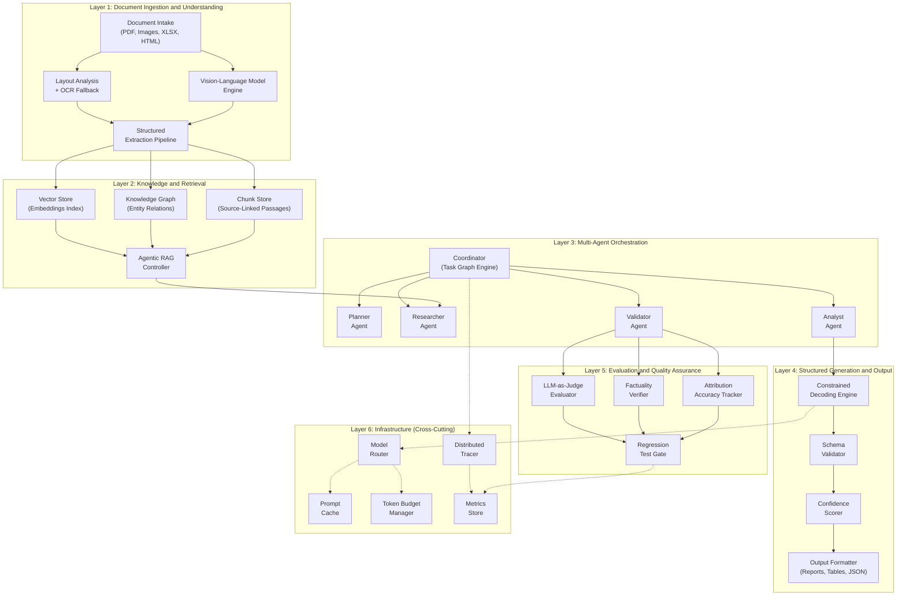
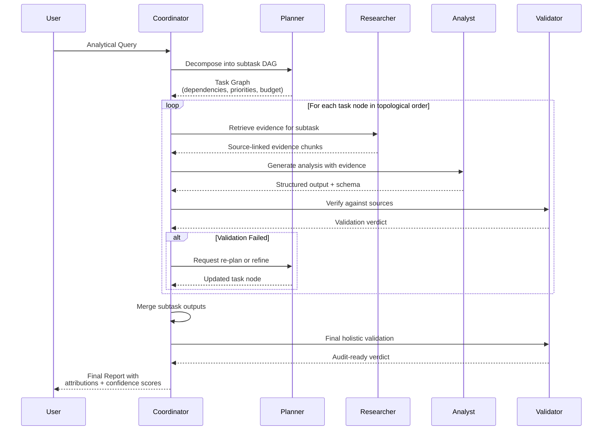
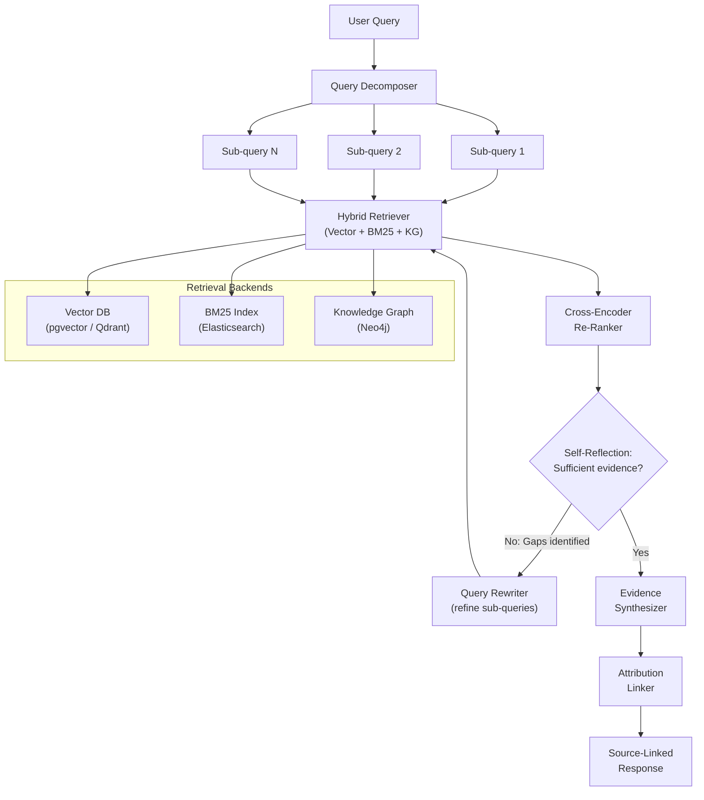
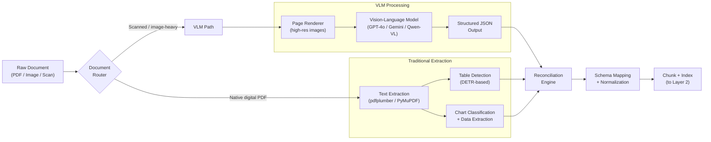
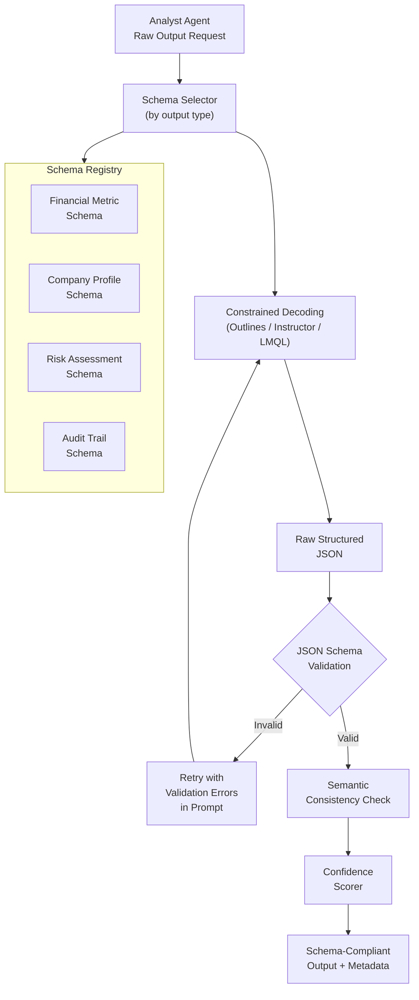
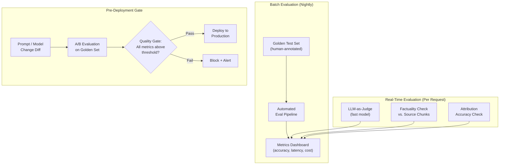
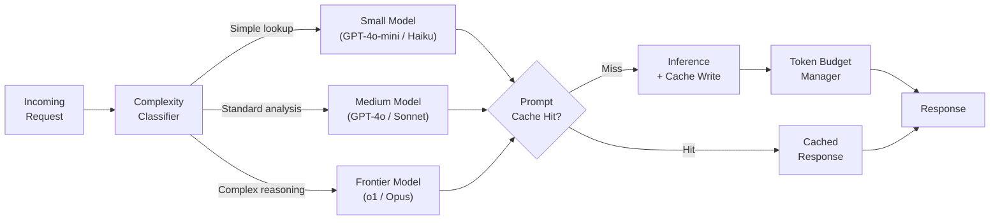
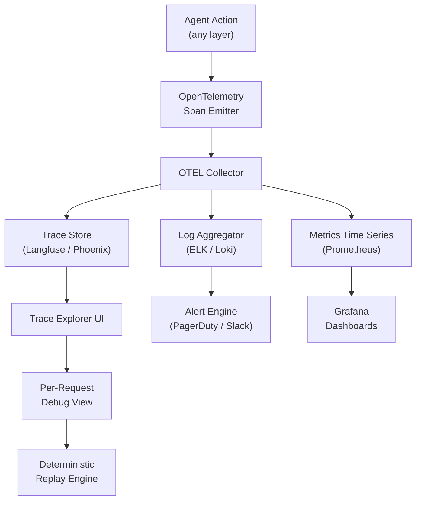

# Institutional-Grade Financial Intelligence Platform — Technical Architecture Proposal

---

## 1. System Architecture Overview

The platform is organized into six architectural layers, each responsible for a distinct concern. Data flows upward from raw document ingestion through reasoning and generation, with evaluation and observability cross-cutting every layer.

---

## 2. Multi-Agent Orchestration — Detailed Workflow

The orchestration layer uses a **task-graph execution model**. The Coordinator decomposes user queries into a DAG of subtasks, assigns them to specialized agents, and manages the feedback loop between execution and validation. This is not a simple chain — agents can request re-planning, and the Validator can reject outputs, triggering retry with refined instructions.

**Key design decisions:**

- **Task Graph, not Chain**: Complex financial queries (e.g., "Compare the leverage ratios of these 5 companies across 3 years and flag anomalies") decompose into parallel subtasks with dependencies. A DAG scheduler handles fan-out/fan-in patterns.
- **Budget-Aware Planning**: The Planner assigns token budgets and model tiers per subtask. Simple lookups route to smaller models; complex reasoning routes to frontier models.
- **Rejection-Triggered Re-Planning**: When the Validator rejects an output, it does not simply retry — it sends structured feedback to the Planner, which can decompose the failing subtask differently or request different evidence.

---

## 3. Agentic RAG Pipeline — Iterative Retrieval with Self-Reflection

Standard RAG fails on financial queries that require multi-hop reasoning, numerical verification, or cross-document synthesis. The Agentic RAG Controller implements a **retrieve-reflect-refine loop** with query decomposition.

**Architecture details:**

- **Hybrid Retrieval**: Every query hits three backends in parallel — dense vector search for semantic similarity, BM25 for exact term matching (critical for ticker symbols, CUSIP numbers, specific financial terms), and knowledge graph traversal for relational queries ("subsidiaries of X", "counterparties to deal Y").
- **Self-Reflection Loop**: After retrieval and re-ranking, an LLM evaluates whether the evidence is sufficient to answer the sub-query. It outputs a structured assessment: `{sufficient: bool, gaps: string[], suggested_rewrites: string[]}`. The loop runs up to 3 iterations with exponential backoff on the retrieval scope.
- **Attribution Linker**: Every claim in the final output maps to `(document_id, page, chunk_id, confidence)`. This is non-negotiable for audit-readiness.

---

## 4. Document Processing Pipeline — Vision-Language Model Architecture

Financial documents contain tables, charts, footnotes, and multi-column layouts that defeat text-only extraction. The document processing pipeline uses a **dual-path architecture**: a VLM path for visual understanding and a traditional OCR+layout path, with a reconciliation step.

**Design rationale:**

- **Dual-Path Reconciliation**: The VLM is excellent at understanding table structure and chart semantics, but can hallucinate numbers. The traditional path is precise on text but poor on layout. The Reconciler cross-checks numerical values between paths, flagging discrepancies for human review when confidence is below threshold.
- **Page-Level VLM Processing**: Financial documents are processed page-by-page at high resolution (300 DPI+). The VLM receives structured prompts requesting specific output schemas per document type (10-K, prospectus, earnings transcript, etc.).
- **Schema Mapping**: Extracted data is normalized to canonical financial schemas (e.g., standardized line items for income statements) enabling cross-document comparison.

---

## 5. Structured Generation Pipeline

All analytical outputs must conform to strict schemas for downstream consumption by financial systems. The pipeline enforces this through constrained decoding, post-generation validation, and confidence scoring.

**Implementation approach:**

- **Constrained Decoding**: Use `Outlines` (for open-source models) or `Instructor` (for API models) to enforce JSON schema compliance at the token level during generation — not just post-hoc validation.
- **Semantic Consistency**: Beyond schema validity, check that values are internally consistent (e.g., assets = liabilities + equity, percentages sum to 100%, dates are chronologically ordered).
- **Confidence Scoring**: A calibrated model produces per-field confidence scores based on evidence sufficiency and extraction difficulty. Fields below threshold are flagged for human review.

---

## 6. Evaluation Framework

The evaluation framework operates at three levels: real-time (inline with every request), batch (nightly regression), and pre-deployment (gate on prompt/model changes).

**Evaluation metrics tracked:**

- **Factuality Score**: Percentage of claims verifiable against retrieved source chunks (target: >95%)
- **Attribution Accuracy**: Percentage of citations that correctly support the associated claim (target: >98%)
- **Schema Compliance**: Percentage of outputs passing full schema validation (target: 100%)
- **Hallucination Rate**: Claims present in output but absent from any retrieved source (target: <2%)
- **Latency P95**: End-to-end response time at 95th percentile
- **Cost per Query**: Total token cost across all model calls per user query

---

## 7. Inference Optimization Layer

Financial workloads are cost-sensitive at scale. The optimization layer reduces latency and cost without sacrificing quality.

**Optimization strategies:**

- **Model Routing**: A lightweight classifier (fine-tuned on historical query complexity) routes requests to the cheapest model capable of handling them. ~60% of queries can be served by smaller models.
- **Prompt Caching**: Shared system prompts and few-shot examples are cached using provider-native caching (Anthropic prompt caching, OpenAI cached tokens). For self-hosted models, KV-cache persistence across requests with common prefixes.
- **Token Budgeting**: Each agent in the orchestration graph has a token budget. The Coordinator monitors cumulative spend and can downgrade model tier or truncate retrieval context if a query is approaching budget limits.
- **Speculative Execution**: For common query patterns, pre-compute partial results during off-peak hours.

---

## 8. Observability and Tracing

Every multi-agent workflow produces a **trace tree** — a hierarchical record of every LLM call, retrieval, validation step, and decision point. This is essential for debugging failures in production and for audit compliance.

**What gets traced:**

- Every LLM call: model, prompt hash, token counts, latency, completion
- Every retrieval: query, results, re-ranking scores
- Every validation: verdict, failure reasons, source references
- Agent state transitions: which agent, what decision, why
- All of this is linked by a single `trace_id` per user request

---

## 9. Recommended Technology Stack

- **Orchestration**: LangGraph (for stateful agent graphs with checkpointing) or custom DAG engine on Temporal (for production durability)
- **LLM Providers**: Anthropic Claude (primary reasoning), OpenAI GPT-4o (structured generation), open-source via vLLM (cost-sensitive paths)
- **VLM**: GPT-4o / Gemini 2.0 Flash (document understanding), Qwen2-VL (self-hosted fallback)
- **Vector DB**: Qdrant or pgvector (depending on scale requirements)
- **Knowledge Graph**: Neo4j
- **Search**: Elasticsearch (BM25 + hybrid)
- **Structured Generation**: Instructor (API models), Outlines (open-source models)
- **Evaluation**: Braintrust or custom framework on LangSmith
- **Observability**: Langfuse (LLM-specific tracing) + OpenTelemetry + Grafana
- **Infra**: Kubernetes on AWS/GCP, with GPU nodes for self-hosted inference
- **CI/CD for Prompts**: Custom regression gate integrated with GitHub Actions

---

## 10. Phased Delivery Approach

- **Phase 1 (Weeks 1-3)**: Document processing pipeline + structured extraction. Stand up the VLM dual-path system, schema registry, and chunk indexing. Deliverable: ingest a corpus of 10-Ks and produce structured JSON.
- **Phase 2 (Weeks 3-6)**: Agentic RAG pipeline. Hybrid retrieval backends, query decomposition, self-reflection loop, attribution linking. Deliverable: query interface that answers financial questions with source citations.
- **Phase 3 (Weeks 6-9)**: Multi-agent orchestration. Planner/Researcher/Analyst/Validator agent graph, task DAG execution, structured generation pipeline. Deliverable: end-to-end analytical workflow for complex queries.
- **Phase 4 (Weeks 9-11)**: Evaluation framework + regression testing. Golden test sets, LLM-as-judge, factuality verification, CI gate. Deliverable: automated quality assurance that blocks regressions.
- **Phase 5 (Weeks 11-13)**: Inference optimization + observability. Model routing, prompt caching, token budgeting, full tracing. Deliverable: production-ready system with cost controls and debugging tools.
